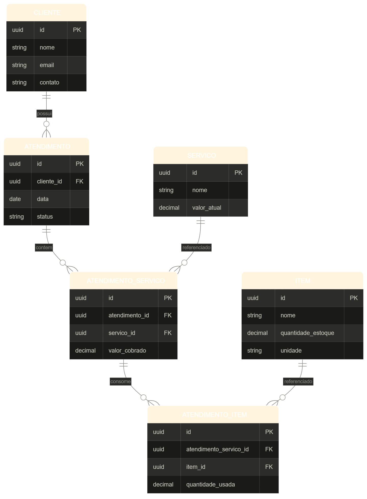

# Cliniva

Sistema de gestão para clínica de estética de pequeno porte —
agenda, clientes, serviços, controle de estoque e financeiro.

## Contexto

Desenvolvido para resolver um problema real (sistema de gestão
acessível pra pequenos negócios) e como projeto de evolução técnica
em backend (Java/Spring Boot) e frontend (React).

## Stack

- **Backend:** Java 21, Spring Boot 4.1, PostgreSQL, Maven
- **Frontend:** React 19, TypeScript, Vite, Tailwind CSS
- **Auth:** Supabase (Auth — JWT validado via JWKS na API)
- **Testes backend:** JUnit 5 + Mockito (H2 em memória)
- **Deploy:** Fly.io (backend) · Vercel (frontend) · Supabase (banco + auth)

## Estrutura do repositório

```
cliniva/
├── backend/       API REST — Java / Spring Boot / PostgreSQL / Maven
│   ├── README.md        Guia completo do backend (PT)
│   └── README.en.md     Technical guide (EN)
├── frontend/      SPA — React + TypeScript + Vite + Tailwind
│   ├── README.md        Guia completo do frontend (PT)
│   └── README.en.md     Technical guide (EN)
├── README.md
└── EDR.png        Diagrama de entidade-relacionamento
```

> Guias detalhados: [backend/README.md](backend/README.md) ·
> [backend/README.en.md](backend/README.en.md) ·
> [frontend/README.md](frontend/README.md) ·
> [frontend/README.en.md](frontend/README.en.md)

## Como rodar localmente

### 1. Requisitos

- Java 21
- Maven 3.9+
- Node.js 20+ (npm)
- Supabase CLI ([instalação](https://supabase.com/docs/guides/cli)) + Docker

### 2. Banco de dados

O schema é versionado em `supabase/migrations/` (Supabase Migrations) e o
backend roda com `ddl-auto=validate` — quem cria o schema é a migração,
não o Hibernate.

Suba o ambiente local do Supabase (Postgres em `localhost:54322`), que
aplica as migrations automaticamente:

```bash
supabase start
```

As credenciais da API/Supabase local ficam em `supabase status`.
Para apontar o backend para o banco local, use:

```bash
SPRING_DATASOURCE_URL='jdbc:postgresql://localhost:54322/postgres' \
SPRING_DATASOURCE_USER=postgres \
SPRING_DATASOURCE_PASSWORD=postgres
```

> Alternativa: `supabase link --project-ref <ref>` + `supabase db push`
> para aplicar as migrations no projeto remoto do Supabase.

### 3. Backend (API em `http://localhost:8080`)

```bash
cd backend
mvn spring-boot:run
```

A migration `20260909000003_seed_administracao.sql` cria a **Clínica
Padrão** e o usuário **ADMIN master**
(`paulovictorpinheiro998663264@gmail.com`), usado no painel `/admin`.

Executar os testes (109 unit/integration tests, usa H2 em memória — não precisa de banco):

```bash
cd backend
mvn test
```

Detalhes completos (endpoints, regras de domínio, erros):
[`backend/README.md`](backend/README.md).

### 4. Frontend (UI em `http://localhost:5173`)

```bash
cd frontend
cp .env.example .env   # preencha VITE_SUPABASE_URL e VITE_SUPABASE_ANON_KEY
npm install
npm run dev
```

O Vite encaminha `/api/*` para o backend (`localhost:8080`) durante o
desenvolvimento. Com auth ativo, todas as rotas exigem login — crie uma
clínica em `/cadastro` (auto-registro) ou use a conta admin master.

Detalhes completos (estrutura, tema, animações, como criar páginas):
[`frontend/README.md`](frontend/README.md).

### 5. Variáveis de ambiente do backend

| Variável | Uso |
|----------|-----|
| `SPRING_DATASOURCE_URL` / `_USER` / `_PASSWORD` | Conexão com o PostgreSQL |
| `SUPABASE_URL` | URL base do projeto Supabase (JWKS + admin API) |
| `SUPABASE_SERVICE_ROLE_KEY` | Service role key (criar usuários/reset de senha) |
| `SUPABASE_JWT_SECRET` | Segredo do JWT (fallback HS256) |
| `CLINIVA_CORS_ORIGIN` | Origem permitida no CORS (default `http://localhost:5173`) |

## API — visão geral

| Recurso | Endpoints |
|---------|-----------|
| Clientes | `GET/POST /api/clientes` · `GET/PUT/DELETE /api/clientes/{id}` · busca por `?nome=`, `?status=` |
| Cliente · CRM | `GET /api/clientes/{id}/historico` · `GET/POST /api/clientes/{id}/notas` · `DELETE /api/clientes/{id}/notas/{notaId}` · `GET /api/clientes/aniversariantes?mes=` |
| Serviços | `GET/POST /api/servicos` · `GET/PUT/DELETE /api/servicos/{id}` |
| Itens/Estoque | `GET/POST /api/items` · `GET/PUT/DELETE /api/items/{id}` · `PATCH /api/items/{id}/estoque` |
| Atendimentos | `GET/POST /api/atendimentos` · `GET /api/atendimentos/{id}` · `PATCH /{id}/status` |

Filtros de atendimento: `?status=`, `?clienteId=`, `?dataInicio=`, `?dataFim=`.

Erros seguem o formato `{"status", "mensagem", "erros"}` (400/401/403/404/409/503).

## Deploy (v0.3.0)

### Supabase (banco + auth)

1. Crie um projeto no [Supabase](https://supabase.com).
2. **Integração com GitHub**: mapeie o repositório (Working directory
   `supabase`) e a **Production branch = `production`**. Ao dar merge
   em `production`, a integração aplica `supabase/migrations/` no banco
   de produção automaticamente.
3. Em **Project Settings → API** copie: URL do projeto, `anon key`,
   `service_role key` e **Project Settings → Database → Connection URI`.
4. Driver JDBC: `jdbc:postgresql://db.<ref>.supabase.co:5432/postgres?sslmode=require`
   (usuário `postgres` e a senha do banco).

> **Ordem recomendada no deploy:** primeiro dê merge em `production`
> (aplica as migrations), depois o deploy da app na `main` — o backend
> sobe com `ddl-auto=validate` e exige o schema já existente.

### Backend (Fly.io)

```bash
cd backend
fly launch   # usa fly.toml + Dockerfile (créditos grátis ou conta Fly)
fly secrets set SUPABASE_URL=https://SEU-PROJETO.supabase.co \
  SUPABASE_SERVICE_ROLE_KEY=<service_role_key> \
  SUPABASE_JWT_SECRET=<jwt_secret> \
  SPRING_DATASOURCE_URL='jdbc:postgresql://...' \
  SPRING_DATASOURCE_USER=postgres \
  SPRING_DATASOURCE_PASSWORD=<senha> \
  CLINIVA_CORS_ORIGIN=https://SEU-DOMINIO.vercel.app
fly deploy
```

Health check: `GET https://<app>.fly.dev/actuator/health`.

### Frontend (Vercel)

1. Importe o repositório na Vercel (framework detectado: Vite), `dist` de saída.
2. Configure as variáveis `VITE_SUPABASE_URL` e `VITE_SUPABASE_ANON_KEY`.
3. Adicione o domínio da Vercel em `CLINIVA_CORS_ORIGIN` do backend.

O arquivo `vercel.json` faz o rewrite SPA para `index.html`.

### CI

GitHub Actions: `Maven test` (backend), `oxlint` + `vite build` (frontend);
deploy automático do backend na `main` via `superfly/flyctl-actions`
(exige o segredo `FLY_API_TOKEN`).

## Status

🚀 **v0.3.0** — Auth, multi-tenant e administração: autenticação via
Supabase (JWKS), isolamento de dados por clínica, painel admin com modo
suporte e deploy em nuvem.

### v0.3.0 · Auth, Admin & Deploy

- **Autenticação JWT** validada no backend via JWKS do Supabase
  (`/api/public` aberto, `/api/**` autenticado, `/api/admin/**` somente ADMIN).
- **Multi-tenant por clínica**: todos os recursos escopados pelo dono; o
  ADMIN acessa qualquer clínica em **modo suporte** (header `X-Clinica`).
- **Onboarding e admin**: `/api/public/onboarding` (auto-registro),
  `/api/admin/*` (listar/criar/detalhar/atualizar clínicas, responsáveis,
  reset de senha e métricas — clientes, atendimentos, receita).
- **Frontend**: `/login`, `/cadastro`, `/trocar-senha`, `/admin` com
  guardas de rota; token anexado automaticamente (`Bearer`) e modo suporte
  no painel admin.
- **Deploy**: backend no Fly.io (Dockerfile + `fly.toml`), frontend na
  Vercel, banco/auth no Supabase, CI no GitHub Actions.
- 109 testes backend verdes.

### v0.2.0 · CRM

- Perfil completo do cliente: data de nascimento, origem
  (indicação/Instagram/Google/passou na rua), canal preferido,
  preferências e observações; status prospect/ativo/inativo.
- **Histórico financeiro** por cliente: atendimentos, gasto acumulado,
  ticket médio, última visita e frequência (`GET /clientes/{id}/historico`).
- **Anotações** por cliente (listar/adicionar/excluir) e bloqueio de
  exclusão de cliente com vínculos.
- **Aniversariantes do mês** (`GET /clientes/aniversariantes?mes=`) e
  selo de fidelidade na lista (novo / recorrente / frequente).
- **WhatsApp**: follow-up na ficha do cliente e lembretes de
  atendimento agendado (link `wa.me` pré-preenchido, sem custo).
- Página **/clientes/:id** com ficha completa, financeiro, histórico e
  anotações (responsiva).
- Dashboard: **novos vs recorrentes** no mês e aniversariantes (com
  botão de saudação via WhatsApp).
- 79 testes backend verdes (unidade + integração de repositório).

### v0.1.1 · responsividade mobile

- Navegação por **drawer** no mobile (rail carbon off-canvas, botão `[ menu ]`
  no cabeçalho; fecha ao navegar / `Escape` / clique no overlay).
- Listas de registro viram **cards** em telas < `md` (Clientes, Serviços,
  Estoque, Atendimentos) — tabelas preservadas no desktop.
- Áreas de toque maiores (botões e campos), `PageHeader`, modais e
  cabeçalho/rodapé adaptados por breakpoint.

## Roadmap

### v0.3.0 · Deploy & Auth ✅

- [x] Autenticação/login via Supabase (JWT validado via JWKS)
- [x] Multi-tenant por clínica + painel admin com modo suporte
- [x] Deploy backend (Fly.io) + frontend (Vercel) + banco (Supabase)

### MVP Backend ✅

- [x] Modelagem de entidades (ERD)
- [x] Setup do projeto (Spring Initializr, Postgres)
- [x] Domínio Cliente (entity, repository, service, controller)
- [x] Domínio Serviço
- [x] Domínio Item (estoque)
- [x] Domínio Atendimento
- [x] AtendimentoServico / AtendimentoItem
- [x] Endpoints de leitura (listagem, busca por id, filtros por query param)
- [x] Validações (Bean Validation)
- [x] Tratamento global de exceptions
- [x] CRUD completo (update/delete) e mudança de status do Atendimento
- [x] Testes unitários (109 testes, suite verde)

### MVP Frontend ✅

- [x] Setup Vite + React + TypeScript + Tailwind (palette da marca)
- [x] Layout com sidebar e navegação
- [x] CRUD de Clientes (com busca por nome)
- [x] CRUD de Serviços
- [x] CRUD de Itens + movimentação de estoque
- [x] Atendimentos: filtros, agendamento (serviços + itens extras), mudança de status
- [x] Dashboard (contagens, próximos atendimentos, estoque baixo)

### Deploy

- [x] Auth/login (Supabase)
- [x] Hospedagem: backend Fly.io + frontend Vercel + banco Supabase
- [x] Deploy backend + banco na nuvem
- [ ] PWA / instalação em home screen

## Ideias futuras (fora do escopo do MVP)

- Integração com IA (a definir o caso de uso específico —
  sugestão de horários, previsão de estoque, resumo do dia, etc.)

## Modelagem

